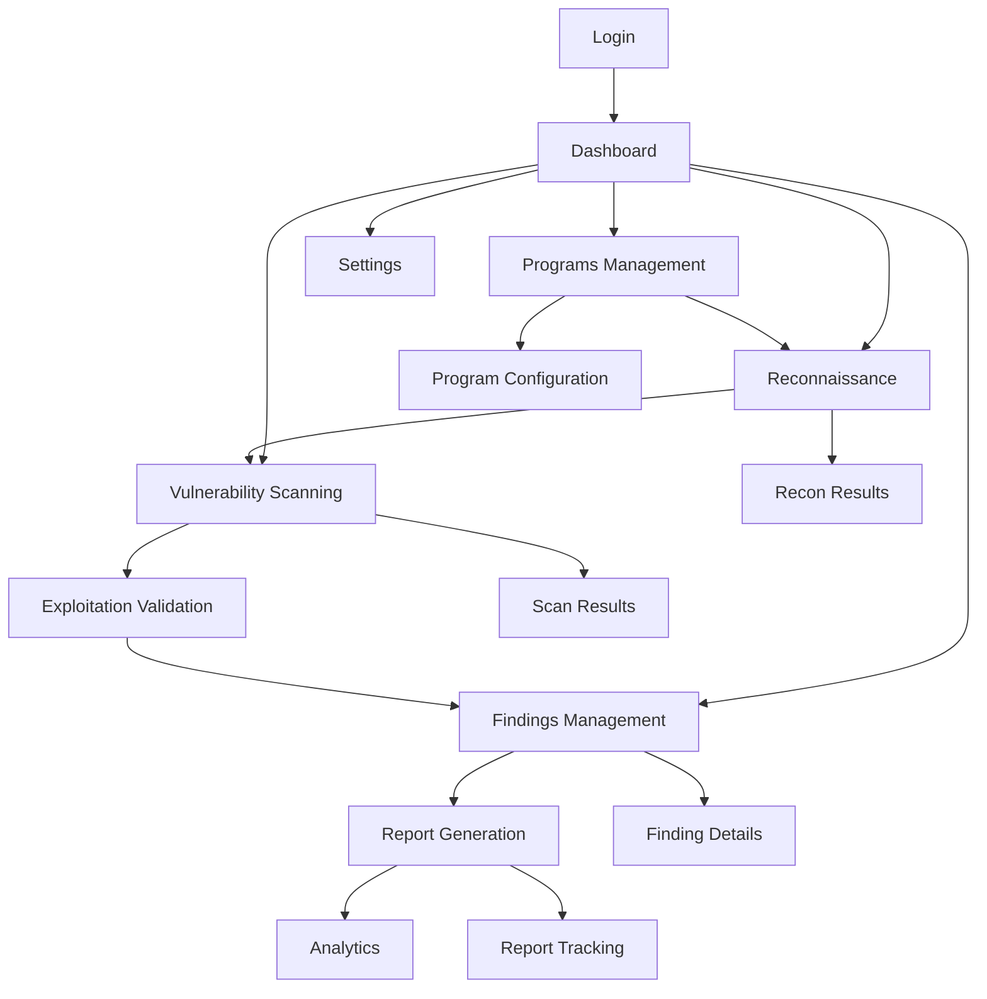

# Bug Bounty Automation Platform - Product Requirements Document

## 1. Product Overview

A comprehensive automation platform for ethical security researchers and bug bounty hunters to streamline vulnerability discovery, validation, and reporting processes. The platform automates reconnaissance, scanning, exploitation validation, and report submission while maintaining strict security guardrails and compliance with bug bounty program policies.

**Target Users**: Security researchers, bug bounty hunters, security teams, and organizations with bug bounty programs.

**Business Value**: Reduces time-to-report by 70%, increases valid finding rate by 25%, and provides scalable security testing automation with built-in compliance safeguards.

## 2. Core Features

### 2.1 User Roles

| Role | Registration Method | Core Permissions |
|------|---------------------|------------------|
| Security Researcher | Email + Identity Verification | Full platform access, program management, automation workflows |
| Enterprise User | Business Email + Domain Verification | Multi-user management, advanced analytics, custom integrations |
| Admin | Manual Assignment | System configuration, user management, security policy enforcement |
| Viewer | Invitation Only | Read-only access to findings and reports |

### 2.2 Feature Module

Our bug bounty automation platform consists of the following main pages:

1. **Dashboard**: Overview of active programs, recent findings, automation status, and performance metrics
2. **Programs Management**: Bug bounty program configuration, scope management, and policy settings
3. **Reconnaissance**: Automated asset discovery, subdomain enumeration, and infrastructure mapping
4. **Vulnerability Scanning**: Configurable security scans with multiple tool integrations
5. **Exploitation Validation**: Safe proof-of-concept validation with impact minimization
6. **Findings Management**: Centralized vulnerability tracking, triage, and analysis
7. **Report Generation**: Automated report creation and submission to bug bounty platforms
8. **Analytics**: Performance metrics, success rates, and ROI tracking
9. **Settings**: User preferences, API keys, security configurations, and team management

### 2.3 Page Details

| Page Name | Module Name | Feature Description |
|-----------|-------------|---------------------|
| Dashboard | Overview Cards | Display active programs count, pending findings, monthly earnings, automation success rate |
| Dashboard | Activity Feed | Show real-time automation progress, completed scans, new findings, and system alerts |
| Dashboard | Quick Actions | Provide shortcuts to start recon, configure new program, view recent findings |
| Programs Management | Program List | Show all configured bug bounty programs with status, scope, and last activity |
| Programs Management | Program Configuration | Set up new programs with scope definition, platform integration, and policy rules |
| Programs Management | Scope Editor | Define in-scope assets, IP ranges, APIs, and testing boundaries with validation |
| Reconnaissance | Target Configuration | Input targets, select reconnaissance depth, configure tool parameters |
| Reconnaissance | Live Progress | Monitor real-time recon progress, view discovered assets, export results |
| Reconnaissance | Results Analysis | Analyze discovered subdomains, technologies, and attack surface expansion |
| Vulnerability Scanning | Scan Profiles | Create and manage scanning profiles (safe/moderate/deep) with tool selection |
| Vulnerability Scanning | Target Selection | Choose targets from recon results, configure scan parameters and scheduling |
| Vulnerability Scanning | Results Dashboard | View scan results, vulnerability details, and risk assessments with filtering |
| Exploitation Validation | Safe Exploitation | Configure safe proof-of-concept validation with impact minimization settings |
| Exploitation Validation | Validation Results | Review exploitation attempts, success rates, and generated evidence |
| Findings Management | Findings List | Display all discovered vulnerabilities with severity, status, and program association |
| Findings Management | Triage Interface | Review, validate, and triage findings with false positive marking and deduplication |
| Findings Management | Detailed Analysis | View comprehensive vulnerability details, technical information, and evidence |
| Report Generation | Report Templates | Select from pre-built templates or create custom report formats |
| Report Generation | Auto-Submission | Configure automatic submission to bug bounty platforms with API integration |
| Report Generation | Tracking System | Monitor report status, platform responses, and bounty awards |
| Analytics | Performance Metrics | Track key metrics: findings per program, success rates, time-to-report, earnings |
| Analytics | ROI Analysis | Calculate return on investment, cost per finding, and revenue trends |
| Analytics | Team Performance | Monitor team productivity, success rates, and collaboration metrics |
| Settings | API Keys | Securely manage API keys for bug bounty platforms and external tools |
| Settings | Security Preferences | Configure security policies, notification settings, and access controls |
| Settings | Team Management | Invite team members, assign roles, and manage permissions |

## 3. Core Process

### Security Researcher Workflow
1. **Program Setup**: Configure bug bounty program with scope and policies
2. **Reconnaissance**: Launch automated asset discovery and mapping
3. **Scanning**: Execute vulnerability scans on discovered targets
4. **Validation**: Safely validate findings with proof-of-concept
5. **Triage**: Review and filter findings for false positives
6. **Reporting**: Generate and submit reports to bug bounty platforms
7. **Tracking**: Monitor report status and bounty awards

### Enterprise User Workflow
1. **Team Configuration**: Set up multi-user environment with role-based access
2. **Program Management**: Configure multiple bug bounty programs across team
3. **Automation Orchestration**: Schedule and coordinate automated workflows
4. **Compliance Monitoring**: Ensure all activities meet security policies
5. **Analytics Review**: Analyze team performance and ROI metrics
6. **Integration Management**: Connect with existing security tools and workflows

### Page Navigation Flow

## 4. User Interface Design

### 4.1 Design Style
- **Primary Colors**: Deep blue (#1E3A8A) for primary actions, red (#DC2626) for critical alerts
- **Secondary Colors**: Gray (#6B7280) for secondary elements, green (#059669) for success states
- **Button Style**: Rounded corners (8px radius), clear hover states, consistent sizing
- **Typography**: Inter font family, 14px base size, clear hierarchy with font weights
- **Layout**: Card-based design with consistent spacing (8px grid system)
- **Icons**: Feather Icons for consistency, security-focused iconography
- **Animations**: Subtle transitions (200ms), loading skeletons for data fetching

### 4.2 Page Design Overview

| Page Name | Module Name | UI Elements |
|-----------|-------------|-------------|
| Dashboard | Overview Cards | Clean card layout with metrics, color-coded status indicators, sparkline charts for trends |
| Dashboard | Activity Feed | Real-time updating list with timestamps, user avatars, and status badges |
| Programs Management | Program List | Table view with sorting, filtering, and quick actions, status indicators |
| Reconnaissance | Target Configuration | Form with validation, tool selection dropdowns, advanced options accordion |
| Reconnaissance | Live Progress | Progress bars, status badges, expandable result cards with tree view |
| Vulnerability Scanning | Scan Profiles | Card-based profile selection, toggle switches for features, risk level indicators |
| Findings Management | Findings List | Data table with severity badges, filtering sidebar, bulk action toolbar |
| Findings Management | Triage Interface | Split-pane view with finding details and triage controls, keyboard shortcuts |
| Report Generation | Report Templates | Template gallery with previews, customization options, platform selection |
| Analytics | Performance Metrics | Interactive charts, date range picker, export options, drill-down capability |
| Settings | API Keys | Secure key display with reveal toggle, expiration dates, usage statistics |

### 4.3 Responsiveness
- **Desktop-First Design**: Optimized for 1920x1080 and 1366x768 resolutions
- **Mobile Adaptation**: Responsive breakpoints at 768px and 480px
- **Touch Optimization**: Larger touch targets (44px minimum) on mobile devices
- **Progressive Enhancement**: Core functionality works without JavaScript
- **Accessibility**: WCAG 2.1 AA compliance with keyboard navigation support

## 5. Security Requirements

### 5.1 Authentication & Authorization
- Multi-factor authentication support
- Session management with secure token handling
- Role-based access control (RBAC)
- API key management with scoped permissions
- Account lockout after failed attempts

### 5.2 Data Protection
- Encryption at rest for sensitive data
- TLS 1.3 for all communications
- Secure key management practices
- Data anonymization for analytics
- Regular security audits

### 5.3 Operational Security
- Audit logging for all critical operations
- Network security with VPC isolation
- Container security scanning
- Dependency vulnerability monitoring
- Incident response procedures

## 6. Performance Requirements

### 6.1 Response Times
- Page load time: < 3 seconds
- API response time: < 500ms for simple queries
- Real-time updates: < 1 second delay
- Report generation: < 30 seconds for complex reports

### 6.2 Scalability
- Support 1000+ concurrent users
- Handle 10,000+ findings per program
- Process 100+ automation jobs simultaneously
- Store 1TB+ of scan results and evidence

### 6.3 Reliability
- 99.9% uptime SLA
- Automated backup every 6 hours
- Disaster recovery within 4 hours
- Zero-downtime deployments

## 7. Integration Requirements

### 7.1 Bug Bounty Platforms
- HackerOne API integration
- Bugcrowd API integration
- Intigriti API integration
- YesWeHack API integration
- Custom platform support via webhooks

### 7.2 Security Tools
- Nmap integration for network scanning
- OWASP ZAP for web application testing
- SQLMap for SQL injection testing
- Nuclei for vulnerability templates
- Custom tool integration via plugins

### 7.3 External Services
- Slack/Teams notifications
- Email service integration
- Cloud storage for evidence
- SIEM integration for enterprises
- Webhook support for custom integrations

## 8. Compliance Requirements

### 8.1 Legal Compliance
- GDPR compliance for EU users
- CCPA compliance for California users
- SOC 2 Type II readiness
- ISO 27001 alignment
- Responsible disclosure guidelines

### 8.2 Security Standards
- OWASP Top 10 protection
- CWE/SANS Top 25 coverage
- NIST Cybersecurity Framework
- Industry-specific compliance (PCI DSS, HIPAA)
- Regular penetration testing

## 9. Success Metrics

### 9.1 User Engagement
- Daily active users: 500+ within 6 months
- User retention rate: 80%+ monthly
- Average session duration: 30+ minutes
- Feature adoption rate: 70%+ for core features

### 9.2 Business Impact
- Time-to-report reduction: 70% improvement
- Valid finding rate increase: 25% improvement
- User productivity: 3x more findings per researcher
- Revenue generation: $1M+ in bounties processed

### 9.3 Technical Performance
- System uptime: 99.9%+
- API response time: < 500ms average
- Security incident rate: < 0.1%
- Customer satisfaction: 4.5+ rating