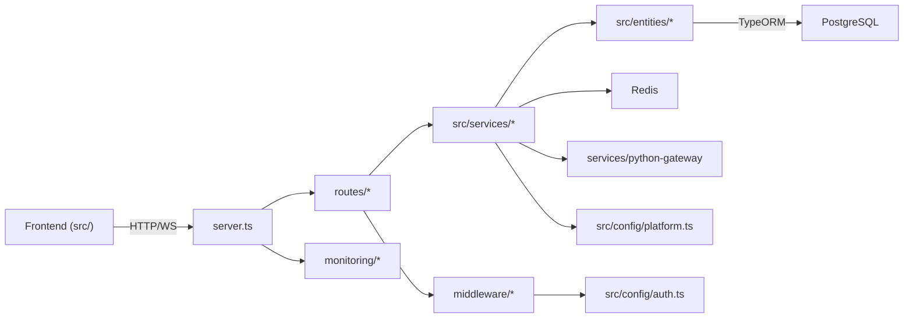

# `api/` — Backend API Server

## Purpose

The `api/` directory contains the **Express.js backend** for the RedTeam Automation Platform. It handles authentication, program management, scan orchestration, vulnerability triage, report generation, and real-time communication via Socket.IO. The server integrates with PostgreSQL (via TypeORM), Redis (for caching and job queues), and the Python gateway for offensive tooling.

## Technology Stack

- **Express 4** with TypeScript
- **TypeORM** for PostgreSQL entity management
- **Socket.IO** for real-time WebSocket communication
- **Bull** for background job queuing (Redis-backed)
- **Winston** for structured logging
- **Helmet** + **express-rate-limit** for security hardening
- **Morgan** for HTTP request logging

## Directory Structure

```
api/
├── server.ts               # Server bootstrap — HTTP, Socket.IO, DB init, shutdown
├── Dockerfile              # (Deprecated — use docker/backend/Dockerfile)
├── tsconfig.json           # Backend-specific TypeScript config
├── nodemon.json            # Dev server hot-reload config
│
├── src/
│   ├── app.ts              # (Deprecated — logic merged into server.ts)
│   ├── config/             # Configuration modules
│   │   ├── auth.ts         # JWT tokens, bcrypt hashing, RBAC permissions
│   │   ├── data-source.ts  # TypeORM DataSource — all 9 entity registrations
│   │   ├── database.ts     # Raw SQL query helper via TypeORM QueryRunner
│   │   ├── platform.ts     # Platform API keys, safety flags, bounty limits, Stripe
│   │   └── redis.ts        # Redis client, cache helpers, connection testing
│   │
│   ├── entities/           # TypeORM entity models (maps to PostgreSQL tables)
│   │   ├── User.ts         # User accounts, roles, permissions
│   │   ├── Program.ts      # Bug bounty programs
│   │   ├── Finding.ts      # Vulnerability findings
│   │   ├── Report.ts       # Generated reports
│   │   ├── Mission.ts      # Scan missions
│   │   ├── TaskResult.ts   # Individual task execution results
│   │   ├── AuditLog.ts     # Activity audit trail
│   │   ├── AgentHealth.ts  # Python agent health status
│   │   └── ScopeAgreement.ts # Scope authorization records
│   │
│   ├── services/           # Business logic layer
│   │   ├── aiService.ts            # Gemini AI integration for analysis
│   │   ├── autonomousService.ts    # Ralph mode — autonomous scan orchestrator
│   │   ├── exploitationService.ts  # Exploitation workflow engine
│   │   ├── exportService.ts        # Data export (CSV, JSON)
│   │   ├── jobQueue.ts             # Bull job queue management
│   │   ├── reconService.ts         # Reconnaissance task orchestration
│   │   ├── reportingService.ts     # PDF/Markdown report generation
│   │   ├── scanningService.ts      # Scan execution and result processing
│   │   └── triageService.ts        # Vulnerability triage and scoring
│   │
│   ├── middleware/         # (Additional middleware in src scope)
│   └── utils/              # (Additional utilities in src scope)
│
├── routes/                 # Express route handlers
│   ├── auth.ts             # POST /api/auth/login, register, logout, refresh
│   ├── programs.ts         # CRUD /api/programs/*
│   ├── findings.ts         # CRUD /api/findings/*
│   ├── scan.ts             # POST /api/scan/start, GET /api/scan/status
│   ├── ai.ts               # POST /api/ai/analyze, /api/ai/triage
│   ├── stats.ts            # GET /api/stats/dashboard, /api/stats/metrics
│   ├── users.ts            # GET /api/users/profile
│   └── api.ts              # Aggregated router mount
│
├── middleware/             # Express middleware stack
│   ├── errorHandler.ts     # Global error handler + notFound + requestLogger + securityHeaders
│   ├── performance.ts      # Rate limiter, production optimizations
│   ├── authorize.ts        # RBAC authorization middleware
│   ├── cache.ts            # Redis response caching
│   ├── rateLimit.ts        # Additional rate limit config
│   ├── requestLogger.ts    # Request logging utility
│   ├── validation.ts       # Input validation (express-validator)
│   └── assets.ts           # Static asset serving middleware
│
├── monitoring/             # Observability stack
│   ├── health.ts           # GET /health, /health/liveness, /health/readiness
│   ├── metrics.ts          # GET /metrics, /health/metrics (Prometheus-style)
│   ├── alerts.ts           # GET/DELETE /alerts — alert rules + monitoring loop
│   └── monitor.ts          # Monitor bootstrap
│
├── tests/                  # Backend test suite
│   ├── setup.ts            # Test harness — mock DB, env
│   ├── helpers.ts          # Test utilities — auth tokens, fixtures
│   ├── auth.test.ts        # Authentication route tests
│   ├── findings.test.ts    # Findings route tests
│   └── programs.test.ts    # Programs route tests
│
├── types/                  # Shared TypeScript type definitions
├── utils/                  # Backend utilities
└── logs/                   # Runtime log output directory
```

## Component Interactions



## Key Behaviors

1. **Server boot**: `server.ts` → `initializeDatabase()` → mount middleware → mount routes → `server.listen()` → optional `startMonitoring()` (production) → optional `autonomousService.start()` (Ralph mode)
2. **Authentication**: JWT access tokens (15m) + refresh tokens (7d), bcrypt password hashing, 3-tier RBAC (admin/user/viewer)
3. **Rate limiting**: Production-only via `rateLimiter` middleware on `/api/*`
4. **Graceful shutdown**: SIGTERM/SIGINT with 10s timeout before forced exit
5. **Socket.IO**: Real-time scan status updates pushed to connected frontend clients
