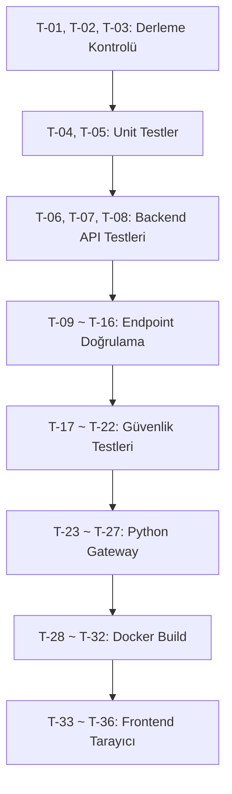

# RedTeam Automation Platform — Test Plan

## Overview

Bu test planı, projenin tüm katmanlarını (frontend, backend, Python gateway, Docker) kapsayan sistematik bir doğrulama sürecidir.

---

## 1. Ön Koşullar

```bash
# Node.js bağımlılıkları yüklü olmalı
npm install
cd api && npm install && cd ..

# Python ortamı hazır olmalı
cd services/python-gateway
python3 -m venv venv && source venv/bin/activate
pip install -r requirements.txt
cd ../..

# PostgreSQL ve Redis çalışır durumda olmalı
docker run -d --name redteam-pg -e POSTGRES_DB=redteam_automation -e POSTGRES_PASSWORD=postgres -p 5432:5432 postgres:15-alpine
docker run -d --name redteam-redis -p 6379:6379 redis:7-alpine
```

---

## 2. Test Matrisi

### 2.1 TypeScript Derleme Kontrolü

| # | Komut | Hedef | Beklenen Sonuç |
|---|---|---|---|
| T-01 | `npx tsc --noEmit --skipLibCheck` | Frontend TSC | Hata yok |
| T-02 | `npx tsc -p api/tsconfig.json --noEmit --skipLibCheck` | Backend TSC | Hata yok |
| T-03 | `npm run lint` | ESLint kontrol | Hata yok |

### 2.2 Unit Testler (Vitest)

| # | Komut | Hedef | Beklenen Sonuç |
|---|---|---|---|
| T-04 | `npm run test:unit` | Tüm unit testler | Tümü geçmeli |
| T-05 | `npm run test:coverage` | Kapsam raporu | Minimum %60 kapsam |

### 2.3 Backend API Testleri

| # | Test Dosyası | Kapsam | Beklenen Sonuç |
|---|---|---|---|
| T-06 | `api/tests/auth.test.ts` | Register, login, logout, token refresh | Tümü geçmeli |
| T-07 | `api/tests/programs.test.ts` | CRUD programlar | Tümü geçmeli |
| T-08 | `api/tests/findings.test.ts` | CRUD bulgular | Tümü geçmeli |

### 2.4 API Endpoint Doğrulama (Manuel / cURL)

| # | Endpoint | Metod | Test Senaryosu |
|---|---|---|---|
| T-09 | `/health` | GET | 200 OK + `status: healthy` |
| T-10 | `/health/readiness` | GET | DB + Redis bağlantı durumu |
| T-11 | `/api/auth/register` | POST | Yeni kullanıcı oluşturma |
| T-12 | `/api/auth/login` | POST | JWT token döndürme |
| T-13 | `/api/programs` | GET | Auth'lu program listesi |
| T-14 | `/api/scan/start` | POST | Scan başlatma (dry-run) |
| T-15 | `/api/ai/analyze` | POST | AI analiz yanıtı |
| T-16 | `/metrics` | GET | Prometheus metrikleri |

### 2.5 Güvenlik Testleri

| # | Test | Komut / Yöntem | Beklenen Sonuç |
|---|---|---|---|
| T-17 | Bağımlılık taraması | `./scripts/security-scan.sh` | Kritik zafiyet yok |
| T-18 | API güvenlik testi | `./scripts/api-security-test.sh` | Tümü geçmeli |
| T-19 | Rate limiting | 100+ istek / 15dk | 429 Too Many Requests |
| T-20 | CORS ihlali | Farklı origin'den istek | CORS hatası |
| T-21 | JWT manipülasyonu | Geçersiz token | 401 Unauthorized |
| T-22 | JSON payload doğrulama | Hatalı JSON gövde | 400 Invalid JSON payload |

### 2.6 Python Gateway Testleri

| # | Test | Yöntem | Beklenen Sonuç |
|---|---|---|---|
| T-23 | Gateway başlatma | `python gateway.py` | FastAPI sunucu çalışır |
| T-24 | Agent runner | `/api/run-agent` POST | Agent başarıyla çalışır |
| T-25 | Red team scanner | Network scan (dry-run) | Sonuç JSON döner |
| T-26 | Blue team validator | Defense validation | Doğrulama raporu döner |
| T-27 | Report engine | Report oluşturma | PDF/MD çıktı |

### 2.7 Docker Testleri

| # | Test | Komut | Beklenen Sonuç |
|---|---|---|---|
| T-28 | Backend build | `docker build -f docker/backend/Dockerfile --target production .` | Build başarılı |
| T-29 | Frontend build | `docker build -f docker/frontend/Dockerfile --target production .` | Build başarılı |
| T-30 | Database build | `docker build -f docker/database/Dockerfile .` | Build başarılı |
| T-31 | Full stack | `docker-compose up -d` | Tüm servisler healthy |
| T-32 | Health check | Container HEALTHCHECK | Tüm konteynerler geçer |

### 2.8 Frontend Testleri (Tarayıcı)

| # | Test | Yöntem | Beklenen Sonuç |
|---|---|---|---|
| T-33 | Login sayfası | Tarayıcıda `/login` | Form render edilir |
| T-34 | Dashboard | Giriş sonrası `/dashboard` | Metrikler görünür |
| T-35 | Programs sayfası | `/programs` | Program listesi yüklenir |
| T-36 | Tema değişimi | Dark/Light toggle | Tema değişir, localStorage'a kaydedilir |

---

## 3. Test Yürütme Sırası



---

## 4. Kabul Kriterleri

| Kategori | Minimum Geçme Oranı |
|---|---|
| Derleme (T-01 ~ T-03) | %100 |
| Unit testler (T-04 ~ T-05) | %100 |
| Backend API (T-06 ~ T-08) | %100 |
| Endpoint doğrulama (T-09 ~ T-16) | %100 |
| Güvenlik (T-17 ~ T-22) | %100 (kritik zafiyet yok) |
| Python gateway (T-23 ~ T-27) | %80 (T-24 dry-run yeterli) |
| Docker (T-28 ~ T-32) | %100 |
| Frontend (T-33 ~ T-36) | %90 |

---

## 5. Hızlı Test Komutu

Tüm otomatik testleri tek seferde çalıştırmak için:

```bash
# Derleme + Lint + Unit testler
npm run type-check && npm run lint && npm run test:unit

# Güvenlik taramaları
./scripts/security-scan.sh && ./scripts/api-security-test.sh

# Docker build doğrulama
docker-compose build
```
